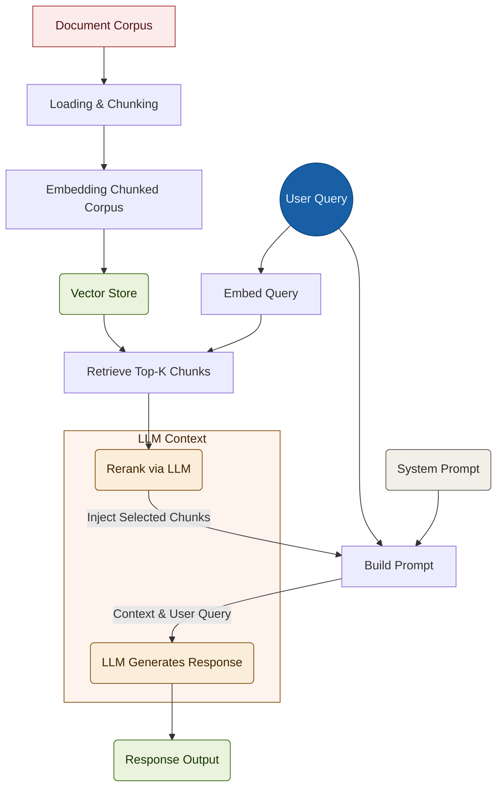

# RAG Pipeline for Markdown Second Brain

A simple RAG pipeline built in Python and Streamlit that uses markdown files from Obsidian second brain for to improve OpenAI API querying context.

## Table of Contents
- Features
- Installation
- Usage
- Tech Stack
- Contributing 
- License

## Features

-**Loading**
-**Chunking** 
-**Embedding**
-**Vector Storing & Search**
-**Querying**

### Architecture Flow 

## Installation

## Usage 

## Tech Stack

## Contributing

## License

